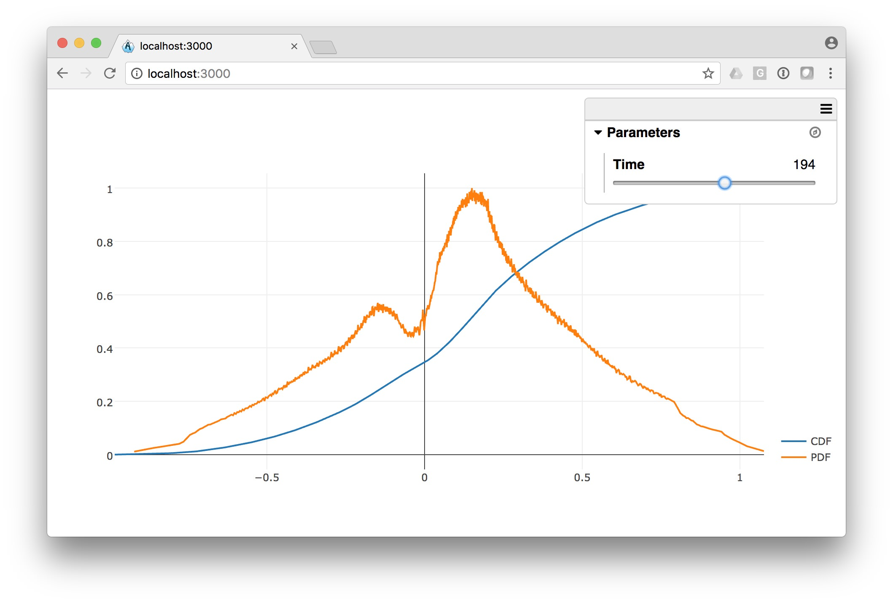

title: CDF extract and PDF visualization 
---

We developed an parallel algorithm to compute a CDF of a given dataset in an efficient manner.
Then we've exported the CDF in a format that can easily be visualized on the Web inside a viewer like [ArcticViewer](https://kitware.github.io/arctic-viewer/) that is illustrated below with a [sample dataset](/summarization/data/oscillator-cdf.tgz).

A Live visualization of that dataset can be seen below:

