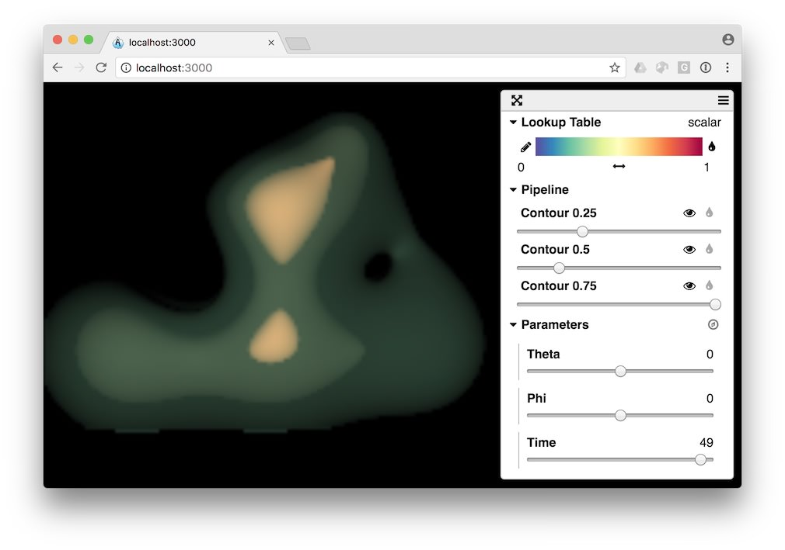

title: Image compositing
---

We can generate an image composite that can dynamically reconstruct using a viewer like [ArcticViewer](https://kitware.github.io/arctic-viewer/) that is illustrated below with a [sample dataset](/summarization/data/oscillator-composite.tgz).

