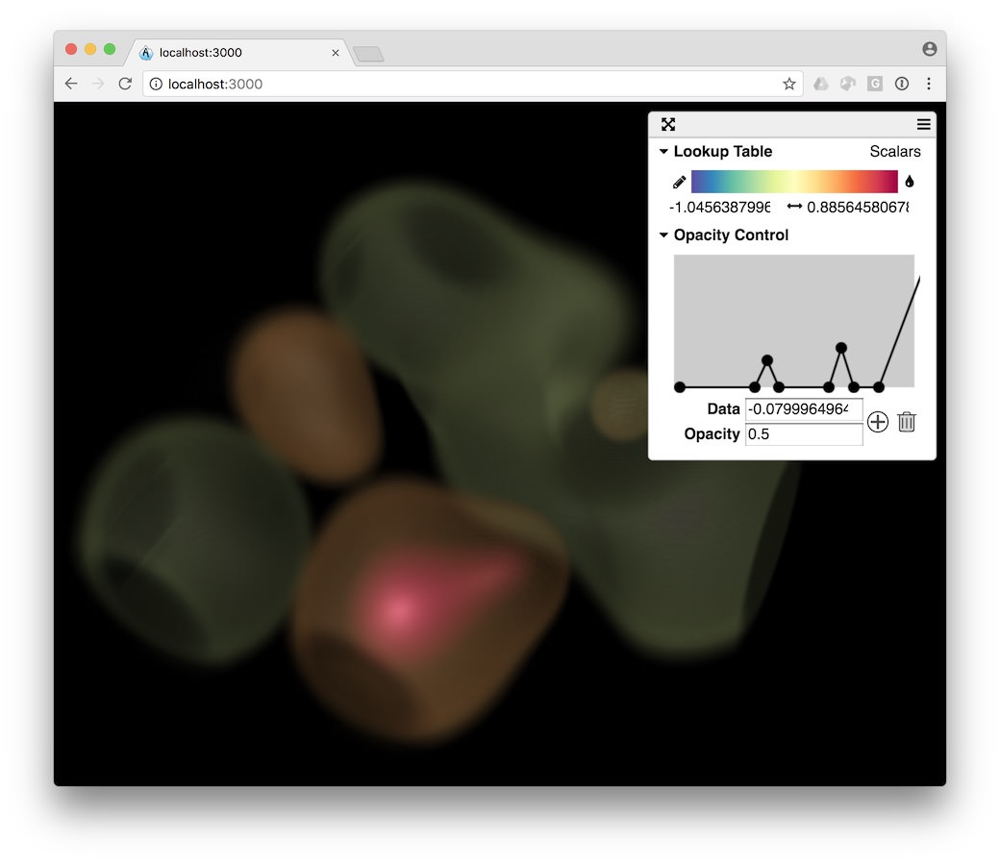

title: Volume reduction
---

We can generate a reduced 3D image that can be loaded inside a viewer like [ArcticViewer](https://kitware.github.io/arctic-viewer/) that is illustrated below with a [sample dataset](/summarization/data/oscillator-volume.tgz).

